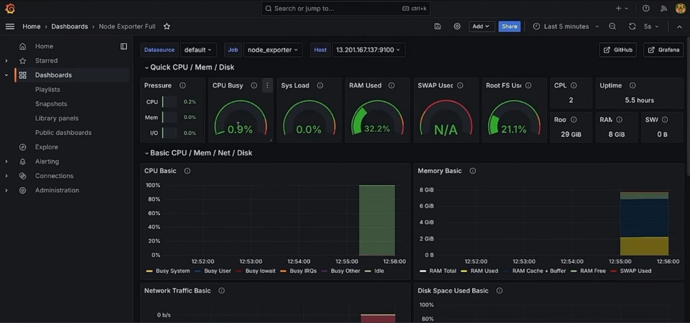
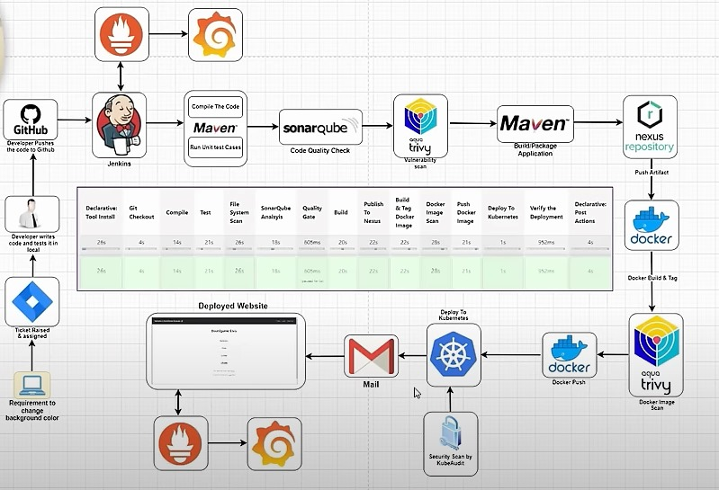

## Overview

The **GameFlow Mastery** project integrates a comprehensive CI/CD pipeline for board game development. This pipeline ensures code quality, security, and efficient deployment, leveraging various tools and technologies to deliver a seamless development and deployment experience for board game projects.

## Tech Stack

- [**Jenkins**](https://www.jenkins.io/doc/): Automates the build and deployment process.
- [**Kubernetes**](https://kubernetes.io/docs/setup/): Orchestrates and manages containerized applications
- [**Prometheus**](https://prometheus.io/docs/prometheus/latest/getting_started/): Monitors the performance and health of applications
- [**Grafana**](https://grafana.com/docs/grafana/latest/): Visualizes monitoring data and creates dashboards
- [**Maven**](https://maven.apache.org/guides/getting-started/index.html): Manages project builds and dependencies.
- [**SonarQube**](https://docs.sonarsource.com/sonarqube/latest/): Analyzes code quality and maintains code health
- [**Trivy**](https://aquasecurity.github.io/trivy/v0.53/): Scans for vulnerabilities in container images
- [**Nexus Repository**](https://help.sonatype.com/en/installation-and-upgrades.html): Stores and manages build artifacts
- [**Docker**](https://docs.docker.com/get-docker/): Containerizes applications for consistent deployment

## Architecture

## Pipeline Flow

- **Developer Setup**: Developers write code and tests locally.
- **Code Commit & Push**: Code is pushed to the GitHub repository.
- **Jenkins Trigger**: Jenkins triggers the pipeline upon code push.
- **Declarative Tool Install**: Installs necessary tools and dependencies.
- **Git Checkout**: Checks out the latest code from GitHub.
- **Compile**: Compiles the code using Maven.
- **Test**: Runs unit tests to ensure code correctness.
- **File System Scan**: Checks for file system anomalies.
- **SonarQube Analysis**: Analyzes code quality and security issues.
- **Quality Gate**: Ensures code meets predefined quality standards.
- **Build**: Packages the application using Maven.
- **Publish to Nexus**: Publishes build artifacts to Nexus Repository.
- **Build & Tag Docker Image**: Builds and tags Docker image.
- **Push Docker Image**: Pushes Docker image to Docker repository.
- **Deploy to Kubernetes**: Deploys the application to Kubernetes cluster.
- **Verify Deployment**: Verifies the successful deployment of the application.
- **System-Level Monitoring**: Configures Prometheus for monitoring system performance and health.
- **Website-Level Monitoring**: Uses Prometheus black-box exporter for monitoring website availability and performance.
- **Visualization**: Uses Grafana to create dashboards for visualizing both system-level and website-level monitoring data.
- **Declarative Post Actions**: Performs post-deployment actions.
- **Notification**: Sends notification about the deployment status.

## Installation

For installation steps and how to configure the project follow the [installation guide docs](./docs)
